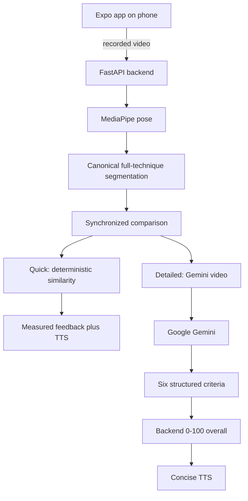

# Final architecture

MMA Trainer V2 is a **local prototype**: an Expo app talks to a FastAPI backend on the same LAN. API keys never enter Expo. Scoring systems were frozen before this documentation pass.

See also [research-architecture-evolution.md](./research-architecture-evolution.md), [limitations.md](./limitations.md), and [demo-guide.md](./demo-guide.md).

## Runtime shape

## Athlete path

Expo app → FastAPI → MediaPipe → canonical full-technique segmentation → synchronized comparison.

### Computer Vision Comparison (Quick)

- Deterministic full-sequence similarity on hip-centered, torso-scaled landmarks.
- Components: Pose / Form, Movement Path, Timing.
- Measured feedback and optional pose overlay.
- No Google Gemini.

### Detailed AI Analysis

- Normalized synchronized AI video (`ai-comparison.mp4`).
- Google Gemini with configured retry and backup model.
- Six structured criteria.
- Deterministic backend overall 0–100 from applicable criterion scores.
- Watch Comparison uses the same file Gemini received.

Quick and Detailed answer **different questions**:

- Quick: how similar is the detected pose sequence to the recorded reference?
- Detailed: what does a video-capable model observe about path, range, positioning, sequencing, balance, and recovery?

Neither is an expert correctness score.

## Storage and privacy

| Data | Where | Lifetime |
| --- | --- | --- |
| Recorded reference | Backend technique store | Until the user deletes the technique |
| Practice attempts | Temporary backend dirs | Periodic cleanup |
| Comparison videos | Temporary comparison dirs | Periodic cleanup |
| Privacy acknowledgements | On-device async storage | Until reset; reset does not delete techniques |
| Validation records | Gitignored validation-runs | Until deleted by the researcher |
| Gemini / OpenAI keys | `backend/.env` only | Never bundled into Expo |

Temp cleanup is periodic, not instant. In-memory AI jobs do not survive a backend restart.

## Gemini fallback

Transient high-demand failures retry with backoff. Auth, quota, and malformed input do not retry. After primary retries, the backend may try `GEMINI_FALLBACK_MODEL`. Fallback exhaustion is a user-visible failure; Quick Comparison remains available.

OpenAI still-image analysis remains in backend source as **experimental / legacy**. It is not a production user option.

## TTS

`expo-speech` reads on-device text already shown on screen. Quick uses measured feedback. Detailed uses a concise Gemini-assisted summary.

## 3D

V1 used Babylon.js / Mixamo GLB. V2 copied those GLB files but does **not** render them. Adding a viewer would require new native 3D modules and would not make the animation an authoritative comparison. 3D is documented as a V1 evaluated representation that was intentionally de-emphasized.

## Validation

Research Validation is a developer / presentation tool. It is not part of normal training. Saved JSON/CSV live under gitignored `backend/data/validation-runs/`.
